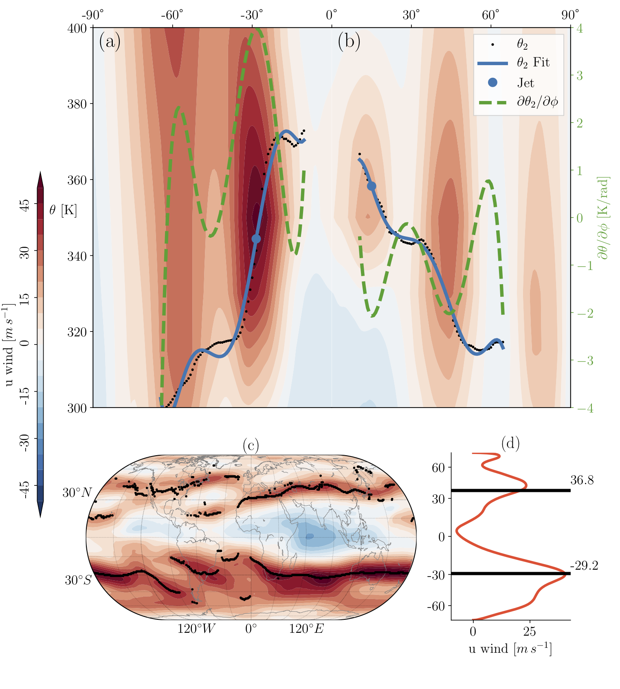

.. STJ Metric documentation master file, created by
   sphinx-quickstart on Thu Oct 13 15:24:48 2016.
   You can adapt this file completely to your liking, but it should at least
   contain the root `toctree` directive.

Welcome to STJ Metric's documentation!
======================================
This is a project to locate the Subtropical Jet, using the gradient of the
dynamical tropopause (an iso-potential vorticity surface of 2 PVU), extensible to other methods.

Code hosted at https://github.com/mkstratos/stj_pv

The paper describing the results of this study have been submitted and are
under review at *Climate Dynamics*.

The stj_diag module can produce details about how the jet is found, like the
figure below.

    An example of the tropopause gradient method for June 2015 using monthly ERA-I data for a single longitude,
    180˚, for the (a) SH and (b) NH. The left y-axis is potential temperature (:math:`\theta`) and right y-axis
    (green) its derivative with respect to latitude (:math:`\partial\theta / \partial\phi`). The dynamic tropopause
    potential temperature (:math:`\theta_2`) is shown with black "." marker, the solid blue line is the polynomial
    fit to :math:`\theta_2`, the dashed green line is the meridional gradient of the potential temperature of the dynamical
    tropopause, and the blue solid circle is the identified subtropical jet position. Contours are the isentropic
    zonal-wind for context only (not part of the algorithm). The zonal wind on the 350 K isentropic surface is shown
    in panel (c) with the identified subtropical jet for each longitude in black. In panel (d) the black line is the
    zonal mean of the subtropical jet latitudes (:math:`\phi_{NH}=36.8` ˚N, :math:`\phi_{SH}=29.2` ˚S) and the orange
    line is the zonal mean zonal wind at 350K for context only (not part of the algorithm). The colour bar relates to
    plots (a-c).

Contents:

.. toctree::
    :maxdepth: 2

    STJ_PV

Indices and tables
==================

* :ref:`genindex`
* :ref:`modindex`
* :ref:`search`

